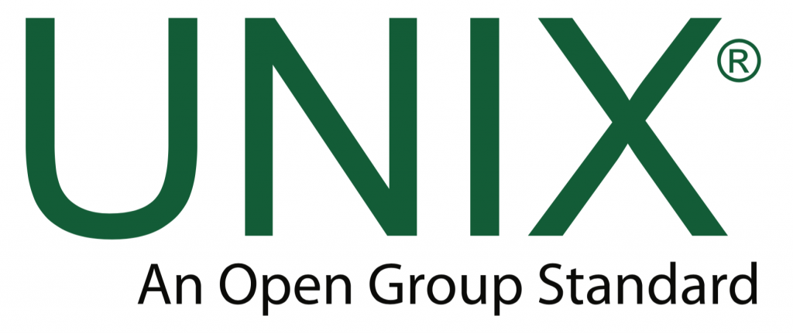

[](https://classroom.github.com/open-in-codespaces?assignment_repo_id=18973112)
# Lab 10 xv6

 In today's lab we are going to  explore and work in the [xv6 operating system](https://en.wikipedia.org/wiki/Xv6). This is a modern reimplementation of the 6th edition of the Unix operating system (which was originally released in 1975) for a modern multiprocessor system. It has a manageable size to work with in a lab (The actual [Linux Kernel is several millions lines of code](https://unix.stackexchange.com/questions/223746/why-is-the-linux-kernel-15-million-lines-of-code)!). That being said, this is still a large piece of software, and getting experience working with mid to large sized source code you are not familiar with is an important skill!

The tasks for today's lab are:

* [ ] Install an emulator
* [ ] Download xv6 from Github, and build an image file using 'make'
* [ ] Modify an unfamiliar piece of source code

# Part 1 - Installation and running xv6

For today's lab, you will be running xv6 on your personal machine. Please see the [InstallationInstructions.md](./InstallationInstructions.md) to install and run xv6 in the QEMU emulator for your operating system. 

**DO NOT DOWNLOAD xv6 INTO THE LAB 10 REPOSITORY!!** 

# Part 2 - Getting familiar with xv6

## Grep'ing around 

Remember the `grep` command ([man grep](https://linux.die.net/man/1/grep))? Grep is a handy way to search for patterns of text, and also a great way to navigate large projects. 

So if you have a medium to large scale codebase like xv6, where would you first start? 

1. One idea would be to find the main function from within the xv6-public directory.
2. Searching the source for references to `main` using something like: `grep -ir -e "main(" .` is a good way to start
  - 'i' means case-insensitive. 'r' means do a recursive search 'e' is the pattern 'main(' which I am looking for, and the '.' at the end tells me where to start this search.
  - After this investigation, we find `main.c` which contains the main function. Starting from main.c is a good way to start understanding a program's [control flow](https://en.wikipedia.org/wiki/Control_flow).

#### Alternative: Ctags

There are alternatives to browsing and familiarizing yourself with a codebase. A traditional tool for this is [Ctags](https://en.wikipedia.org/wiki/Ctags). Ctags is a source code indexing program that scans a collection of source files and builds a database for fast searching. The resulting index (tag file) can be used by some text editors like vim or emacs. The advantage over just greping around is that it is language-sensitive -- instead of performing a full-text search, it actually considers _symbols_ (function, variable and type names) and their uses and definitions. To install Ctags on your VM, use

```
$ apt-get install universal-ctags
```

Then enter the source directory you wish to explore (e.g., `xv6-public`) and run

```
$ ctags -R
```

This will create an index ( a "tag file") of all the symbols found in the source files. 

For example, in Vim, you can search for a specific symbol using the `:ts` command. E.g., 

```
:ts entry
```

to search for the symbol `entry` in the codebase. You can also use Ctags with Emacs, and some other source code editors.

For a quick tutorial, e.g., see <https://courses.cs.washington.edu/courses/cse451/10au/tutorials/tutorial_ctags.html>.

## Run xv6

1. Launch qemu and begin to run xv6 for your respective operating system (`make qemu-nox`).
2. While running the emulator type `ls` and you will see all of the programs you have available.
    - (While xv6 does not have as many as we have available in Unix--it is a start!)

**Discuss with your teammate:** *List five programs you observe with your partner(s) that look familiar from Unix*

1. echo
2. cat
3. grep
4. ls
5. mkdir

# Part 3 - Extending xv6

Remember that applications like `ls`, `wc`, `cat`, are all programs that someone has written and compiled as a binary. Let us add a simple binary to our xv6 operating system. This will also give us an idea of how the build process works for xv6, and how we can extend our operating systems functionality.

- First, make sure you have exited the emulator.
    - As a reminder, **typing `[Ctrl]-a` then  `x` will terminate xv6.**
- Within the root directory of the `xv6-public` directory you will see all binaries for different programs and their corresponding .c files.
- Let's emulate the style of command by copying a previously created file: `cp echo.c mycommand.c`
    - Reminder: You are doing this outside of the emulator.

Here is the code for our command:

```c
// mycommand.c
//
// Three files are included.
// None of which are the usual like
// '<stdio.h>' which we are use to seeing.
// (This is because we have to use code libraries provided by xv6)
#include "types.h"
#include "stat.h"
#include "user.h"

int main(int argc, char *argv[]){
    
    int i;
    for(i = 1; i < argc; i++){
        // Remember what the '1' is as the first argument?
        printf(1, "%s%s", argv[i], i+1 < argc ? " " : "\n");
    }
    // An exit call rather than return statement    
    exit();
}
```

1. Now in order for this to be integrated into the build process, we need to modify our 'Makefile' file.
2. Open the 'Makefile' in vim and modify the following:
    - Under UPROGS add: `_mycommand\` (Emulate the exact style, do not forget the slash at the end)
    - Under EXTRA add: 'mycommand.c'
    - Now type 'make clean' and then 'make' to repeat build process you did earlier to rebuild the operating system.
      - `make clean` ensures that you are doing a clean build.
      - You may not need to run `make clean` every build as 'make' is usually smart enough to only rebuild the files that have been changed--though it is useful  to ensure all changes are implemented.
3. You can now do a test by launching xv6 (`make qemu-nox`), and then typing 'ls'. 
    - You should see your command listed.
4. Now try typing `mycommand test` and you should see the same output you would as if you did `echo test`
    - (We can begin appreciating the work that has gone into our modern operating systems!)

# Part 4 Grep'ing around to learn

- Now investigate each of the header files:
    - `types.h`, `stat.h`, and `user.h` in your editor. Take a few minutes to see what you find.

**Discuss with your teammate:** 

- *In a sentence, what does `types.h` contain?* --> It creates short names for some number types, so instead of writing unsigned int, unsigned short, or unsigned char, you can just write uint, ushort, or uchar, and it also gives uint another name: pde_t.
- *In a sentence, what does `stat.h` contain?* --> It defines some number labels (T_DIR, T_FILE, T_DEV) to represent different file types and creates a stat structure to store information about a file, like its type, size, and location on the disk.
- *In a sentence, what does `user.h` contain? List 6 (or more) functions that look like ones you have used before.* --> It sets up some system commands for things like running programs, reading and writing files, and managing memory, plus some helper functions for handling text, memory, and printing.

# Part 5 - Implementing a System Call (Extending xv6 further).

(Reference Chapter 3 for more: <https://pdos.csail.mit.edu/6.828/2014/xv6/book-rev8.pdf>)

We have seen conceptually how system calls worked, and even used them in assembly(e.g. write) and our C code (e.g. brk). When we use these system calls, our user programs are requesting the kernel to perform some action. In order for the kernel to perform this action, a [context switch](https://en.wikipedia.org/wiki/Context_switch) occurs, the action is performed, and then the user program gets control again.

Recall at a high level what happens during a system call.

1. A trap is issued. This stops the process from running.
2. The process needs its registers saved.
3. We switch to kernel mode and perform work.
4. Restore our registers with any applied changes as we give the user program back control.

## Getting started

Let us first take a look at syscalls that are already implemented and perform a walk through. The below is a variant of my work process and how one could 'wander around' when in unfamiliar codebases. The question we are trying to answer is **What does it require to create a new system call?** (Walk through these steps)

- I have some hunch where these system calls live, but let's grep anyway `grep -ir -e "sys" --include="*.h" .` this time looking in the header file for some hints.
- We see `syscall.h` pops up often and looks releveant, so let's open that file.
    - Modify `syscall.h` and add the following syscall :
    -  `#define SYS_myname 22` 
- At this point, we might look in `syscall.c` the corresponding file to our header file.
    - After browsing this file we notice a few things.
      - One is that the comments at the top of the file discuss a requirement to save program counter.
      - The second is there are a few helper functions for working with the system call(e.g. syscall(void).
      - The third is there is a list of function prototypes, and a jump table with function pointers we might need to add to.
      - Let's go ahead and add to syscall.c
        - `extern int sys_myname(void); // Add this around line 106`
        - `[SYS_myname]  sys_myname, // This line in the list of function pointers around line 130`


- Now at this point, we need to figure out where to look next. Let's continue grep'ping around.
- Let's look at the other header files within syscall.c starting with types.h
    - `types.h` -- nothing too interesting in here (you already saw this). Let's move along
    - `defs.h` -- ah, okay some interesting stuff here. 
      - More lists of things, maybe there are other system calls here?
      - In fact next, let's add `int      myname(void); // under proc.c which falls around line 123.`
- Let us continue our tour from `syscall.h` and next open up `param.h`
    - This file shows us some more configurations of our xv6 operating system.


- Let's do some more grep'ing and see where we need to add our system call.
    - `wait` is another system call that we know and it fell under `proc.c` (and it matches our functions signature). What we  want to find is its function prototype, or where it is defined.
    - We can look back at `defs.h` and see the form.
    - Let's try: `grep -ir 'int wait(.*);' .` and find `users.h` has definitions.
    - When we look in `user.h`, we see in the comments 'system calls' (Isn't it **great** when folks comment their code!)
      - Add `int myname(void);` to the list.
    
- Okay, now we want to figure out where to implement 'myname'.
    - Let's look to `wait` again, and try `grep -ir "wait(*.*)" .`, with our goal being to find the *actual implementation.*
    - We get lots of hits, so let's narrow this down slightly.
        - Knowing that an implementation is a `.c` file, let's try: `grep --include="*.c" -ir 'wait(*.*)' .`
        - At this point, let's make an educated guess that the `usertests.c` file is not useful.
            - As we browse, we  see a prototype, and see it is of the form `sys_wait(void)` in `syscall.c`. We also see `sysproc.c` has this same `sys_mysystemcall` pattern as well.
        - One more grep just to be sure: `grep --include="*.c" -ir 'sys_wait(*.*)' .`
    - In `sysproc.c` add at the very bottom
      ```c
      // Our custom system call
      int sys_myname(void){
          return myname();
      }
      ```
    - In syscall.c we already did everything
        - (`sys_mysystemcall` pattern we saw in the functional pointer table was handy for grepping)
      
Okay, so we have done quite a bit so far, but we are not *quite* done.

- During the `grep`s you may have noticed `SYSCALL(wait)` appears quite often. After more investigation, `usys.S` is the responsible file that needs modified.
    - Add `SYSCALL(myname)` at the end near line 32.
- Finally after one more grep `grep -ir 'wait(void)' .` we see that `proc.c` is where we can implement our command.
    - Add at the very end of the file
    ```c
    int myname(void){
        // Let's just print hello
        cprintf("hello from syscall written by [yourname], [your email addresss]!\n");

        return 22; // Our system call number
    }
    ```
  
  
**Final Step**

* Type: `make` and rebuild xv6 (Otherwise following the steps to build for your respective operating system). If all worked out well, xv6 should rebuild again.
  

# Part 6 - Testing your system call.
  
Okay, now we just need to make a program that uses our syscall. 

1. Exit the emulator and create a file called `myname.c`.
    - Think about what goes in this program first, a solution is in the appendix.
2. Add `myname.c` to our Makefile as we did before.
    - Under EXTRA add `myname.c`
    - under UPROGS add `_myname`
3. We will need to rerun 'make' again and then launch qemu.
    - If for some reason make says it is up-to-date, run `make clean` to make sure all old files are deleted, then run make again.
4. To test our system call, run the `./myname` user program, which simply makes a system call. 
  
* Note: Sometimes naming things "weirdly" will make them easier to grep for when first learning. 
* Note: If things did not work for you, or if something is really messed up, just download xv6 again and start from the begining.

## Lab Deliverable
- Respond to the discussion prompts in <notes.md>. 
- Implement the syscall 'myname' 
    - Commit `myname.c`, `mycommand.c` and your `Makefile` to the repository.
    - **Copy** the `xv6_public` dirctory into your Lab 10 repo directory, e.g., `cp xv6-public/* [location of Lab 10 repo]`. **Confirm that  NO subdirectories  from the xv6 repo were copied over.**
    - **Don't check in _any_ the executables -- `make clean`**
    - Add all the files to your repo, `git add .`
    - Commit all the files to your repo.
    - Submit it the zipfile to Gradescope. 
    

## More Resources to Help

* xv6 is fairly widely used for operating systems exercises. If you have install problems, searching the web will likely yield a working result.
* If you want to debug xv6 while developing, you can type `make qemu-gdb` When launching this will give you a process id that you can attach to (You will see it as tcp:12345, where 12345 is shown). Then launch gdb. Then type `target gdb remote:12345`
* More on grep: https://www.gnu.org/software/grep/manual/html_node/Regular-Expressions.html


## Appendix

```c
// myname.c
#include "types.h"
#include "stat.h"
#include "user.h"

int main(int argc, char *argv[]){

    myname();

    exit();
}
```
